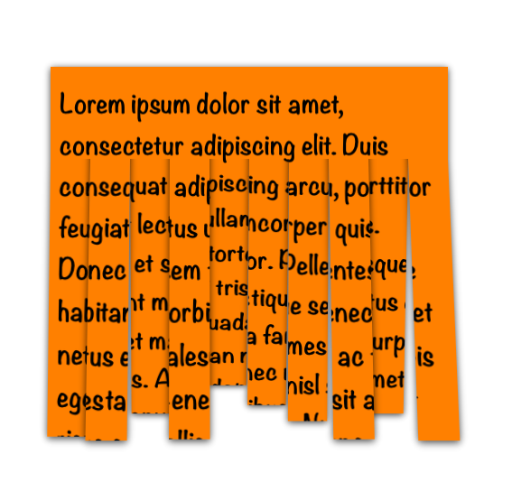

CutViewIntoPieces
=================

The beginning of replicating the shredder animation in Passbook for iOS using Core Animation

Unfortionately I never got around to finish it but it may still be helpful to some. This is how far I got: 

There is a noticeable edge where the view cuts into pieces but that would be covered up by the shredder itself so it shouldn't matter that much.

[This question on Stack Overflow][so] got me to dig up this piece of code and post it so that someone might benefit from it.

[so]:http://stackoverflow.com/q/18072335/608157
